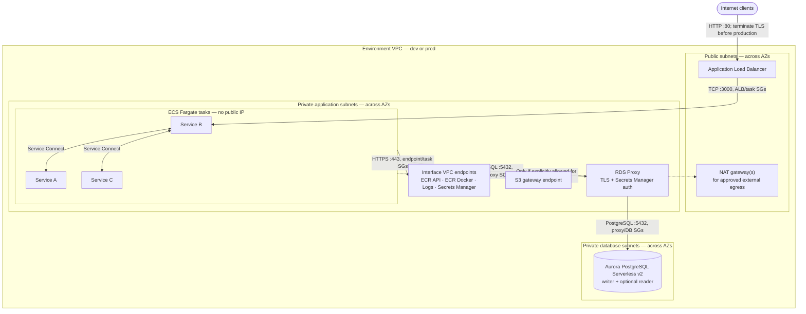

# AWS ECS Fargate Service Connect

This repository contains a Vite/React architecture guide, local Docker Compose
support for that website, and reusable Terraform for deploying the three-service
AWS ECS Fargate architecture described in the guide.

## Run the website locally

Install Docker with the Compose plugin and start the Vite development server:

```sh
docker compose up -d
```

Open [http://localhost:3000](http://localhost:3000). Compose mounts the website
source into the container and stores installed npm dependencies in a named
volume. The source changes are picked up by Vite.

```sh
docker compose logs -f app  # Follow application logs
docker compose ps           # Check service status
docker compose down         # Stop the app
```

To use another host port, for example 8080:

```sh
APP_PORT=8080 docker compose up -d
```

The equivalent Make targets are `make local-up`, `make local-logs`,
`make local-ps`, and `make local-down`. This local website is separate from the
Rust microservices deployed to ECS.

## Terraform architecture

Terraform uses the shared modules under `modules/` to create separate `dev` and
`prod` environments:

- `modules/vpc` creates a VPC, public and private subnets across multiple
  availability zones, isolated database subnets, an Internet Gateway, NAT
  gateways, and private AWS service endpoints for ECR, CloudWatch Logs, Secrets
  Manager, and S3.
- `modules/ecs` creates an ECS Fargate cluster, Cloud Map private namespace,
  ECR repositories, CloudWatch log groups, security groups, three Service
  Connect services, and an internet-facing Application Load Balancer for
  service B.
- `modules/rds` creates an encrypted Aurora PostgreSQL Serverless v2 cluster
  and an RDS Proxy in private subnets. RDS manages the master credential in
  Secrets Manager, while the proxy uses a separate generated application secret.
- Service B reaches service A at `http://service-a:8080` and service C at
  `http://service-c:8081` through Service Connect. The load balancer sends
  HTTP traffic to service B.



The ECS tasks and RDS Proxy have no public IPs and run in private application
subnets. Aurora runs in dedicated isolated database subnets with no default
route to the internet; its subnet group spans the environment's AZs.
Security-group rules allow
the ALB to reach service tasks, ECS tasks to communicate with one another for
Service Connect, ECS tasks to connect to the proxy on TCP 5432, and only the
proxy to connect to Aurora. The database and proxy do not accept CIDR-wide or
public ingress. ECS egress to AWS endpoints and S3 is scoped to endpoint
security groups and the S3 managed prefix list. NAT remains available for
internet egress, but task security groups do not permit arbitrary outbound
internet traffic by default; add explicitly scoped egress rules if a service
requires an external API.

RDS manages the master credential in Secrets Manager; it is used for
administrative access and is not made available to ECS. The
`/integration/<environment>/database` secret stores the proxy host, port, and
database name. A separate `/integration/<environment>/database-credentials`
secret stores a generated, restricted application username and password. The
RDS Proxy role can read only the credentials secret. The ECS task execution
role can read only these two integration secrets, and ECS injects their JSON
keys as `DATABASE_HOST`, `DATABASE_PORT`, `DATABASE_NAME`,
`DATABASE_USERNAME`, and `DATABASE_PASSWORD` when service B tasks start.

Create the PostgreSQL role `service_connect_app` with the generated password
from the credentials secret and grant it only the database privileges the
application requires before enabling database operations. Terraform does not
run database DDL or grant application schema privileges. The absent Rust
service source means the migration/bootstrap and database client setup are not
included.

ECS reads injected secret values when a task starts. Force a new ECS deployment
after changing the integration secret so running tasks receive updated values.
The connection-settings secret contains no passwords, and the
`database_master_secret_arn` output is only an identifier.
Terraform state includes the generated application password; limit access to
the encrypted, versioned S3 backend and its state locks.

The environment settings follow the supplied architecture context:

| Setting | Dev | Prod |
| --- | --- | --- |
| VPC CIDR | `10.0.0.0/16` | `10.1.0.0/16` |
| Availability zones | 2 | 3 |
| NAT gateways | 1 (lower cost) | 1 per AZ |
| Tasks per service | 1 | 3 |
| Fargate CPU / memory | 256 / 512 MiB | 1024 / 2048 MiB |
| CloudWatch retention | 14 days | 90 days |
| Container log level | `debug` | `info` |
| ECR image tag policy | Immutable | Immutable |
| Aurora Serverless v2 instances | 1 | 2 (writer and failover reader) |
| Aurora Serverless v2 capacity | 0.5–2 ACUs | 1–8 ACUs |
| RDS Proxy | Yes | Yes |
| Aurora backup retention | 1 day | 14 days |
| Aurora deletion protection | Off | On |

**Cost notice:** Applying the production configuration provisions an ALB,
three NAT gateways, nine Fargate tasks, an Aurora cluster with two instances,
RDS Proxy, interface endpoints, and a customer-managed KMS key, which can incur
significant AWS charges. The dev environment also provisions Aurora, an RDS
Proxy, interface endpoints, and its own KMS key. Review regional pricing and
remove unused environments when no longer needed. The ALB listener is
HTTP-only for this demo; add TLS and an HTTPS listener before exposing
production traffic.

## Deploy with Make

You need Terraform 1.10 or newer, AWS CLI credentials with permission to create
the VPC, endpoints, ECS, ECR, IAM, Cloud Map, load-balancing, RDS, Secrets
Manager, and logging resources, and Docker. Configure credentials and bootstrap
the S3 Terraform state backend in the configured AWS region (the Makefile uses `AWS_REGION`, then
`AWS_DEFAULT_REGION`, then the default AWS profile region):

```sh
aws configure
make setup
```

The backend defaults to bucket `terraform-state-serviceconnect`. Override
`TF_BACKEND_BUCKET` if that globally unique name is already owned. The bucket
is versioned, encrypted, and blocked from public access. Terraform uses native
S3 lock files (`use_lockfile`), so no DynamoDB table is required. The first
`make init` requires the bucket to exist; run `make setup` first with the same
AWS profile and region.

Initialize and inspect an environment:

```sh
make init/dev
make plan/dev IMAGE_TAG=dev-latest
```

Terraform creates environment-specific ECR repositories named, for example,
`dev-service-a` and `prod-service-a`. Create them before pushing application
images:

```sh
make ecr-create/dev
make ecr-login
```

The Make image build targets expect Rust service projects at
`services/service-a`, `services/service-b`, and `services/service-c`, each with
`Cargo.toml`, `Cargo.lock`, and `src/`. **Those service source directories are
not included in this checkout.** Add the service implementations (or build and
push compatible images separately) before running the image build or apply
pipeline. The ECS task definitions expect ARM64 images that listen on
`0.0.0.0:3000` and provide `/health`.

Once the service source and images are available, the full pipelines are:

```sh
make deploy-dev
make deploy-prod
```

`deploy-dev` builds and pushes a commit-tagged dev image before applying dev.
`deploy-prod` requires confirmation, uses an immutable commit tag, and applies
prod. The corresponding steps can also be run individually:

```sh
make build-dev
make push-dev
make apply/dev IMAGE_TAG=dev-<git-sha>
make output/dev
```

Use `make plan/prod`, `make apply/prod`, `make output/prod`, and
`make destroy/prod` to manage production separately. Applying or destroying
production requires confirmation. `make destroy` processes both environments.
Destroying an environment also deletes its ECR repositories and stored images.

Useful outputs include `load_balancer_url`, `ecr_repository_urls`,
`service_connect_endpoints`, `database_endpoint` (the proxy),
`database_cluster_endpoint`, `database_reader_endpoint`, `database_name`,
`database_master_secret_arn`, `database_integration_secret_arn`,
`database_credentials_secret_arn`, `vpc_id`, and `cluster_name`.

## Quality checks

```sh
make fmt
make validate
make lint
make security-scan
make full-check
```

Terraform's provider lock file is committed to keep provider selections
consistent. `make clean` removes generated Terraform working directories and
plans without deleting the lock file or state stored in S3.
