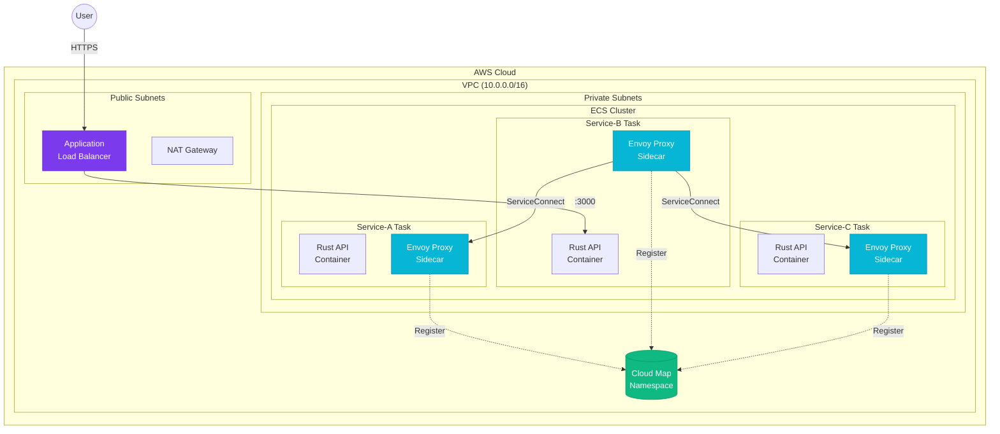

<div align="center">

# 🌐 ServiceConnect with CDK & Terraform

### Building Strong Service Affinity on AWS ECS

*A complete reference implementation for deploying connected microservices with AWS ECS ServiceConnect, featuring both CDK and Terraform IaC approaches with multi-environment support.*

[](https://www.terraform.io/)
[](https://aws.amazon.com/ecs/)
[](https://www.rust-lang.org/)
[](https://www.docker.com/)
[](https://github.com/features/actions)
[](LICENSE)

</div>

---

## 📖 Table of Contents

- [What This Project Does](#-what-this-project-does)
- [Architecture](#-architecture)
- [Project Structure](#-project-structure)
- [Prerequisites](#-prerequisites)
- [The Makefile — Step by Step](#-the-makefile--step-by-step)
- [Local Development](#-local-development)
- [Deployment Workflow](#-deployment-workflow)
- [CI/CD Pipeline](#-cicd-pipeline)
- [Environment Comparison](#-environment-comparison)
- [Troubleshooting](#-troubleshooting)
- [Contributing](#-contributing)
- [License](#-license)

---

## 🎯 What This Project Does

This project demonstrates how to build and deploy **three interconnected Rust microservices** on AWS ECS using **ServiceConnect** — AWS's native service mesh built on Envoy proxy. It provides **two complete Infrastructure-as-Code implementations**:

| Approach | Description |
|----------|-------------|
| **AWS CDK** | TypeScript-based, leverages high-level constructs for rapid development |
| **Terraform** | HCL-based, modular design with reusable components and multi-environment support |

### The Three Services

```
┌─────────────┐         ┌─────────────┐         ┌─────────────┐
│  Service-A  │◄────────│  Service-B  │────────►│  Service-C  │
│  (Provider) │  :8080  │ (Orchestr.) │  :8081  │  (Provider) │
└─────────────┘         └──────┬──────┘         └─────────────┘
                               │
                               │ :3000
                               ▼
                        ┌─────────────┐
                        │     ALB     │
                        │  (Public)   │
                        └─────────────┘
```

- **Service-A** — Returns `(Hello)Field 1` data
- **Service-B** — The entry point. Calls Service-A and Service-C, aggregates responses
- **Service-C** — Returns `(Hello)Field 2` data

A single `GET` request to Service-B produces:

```json
{
    "key_one": "(Hello)Field 1",
    "key_two": "(Hello)Field 2",
    "key_time": "2024-07-07T02:44:59.984673361Z"
}
```

### Why ServiceConnect?

ServiceConnect solves the **"good neighbor" problem** in microservice architectures:

- 🏷️ **Friendly DNS names** — `http://service-a:8080` instead of load balancer URLs
- 🔀 **Topology abstraction** — Services don't need to know about networking
- 🔒 **mTLS support** — Encrypted service-to-service communication
- 🔄 **Automatic retries** — Handle transient failures gracefully
- ⚡ **Circuit breaking** — Bad neighbors can't cascade failures
- 📊 **Built-in observability** — Latency, connections, and dependency tracking

---

## 🏗️ Architecture

### High-Level Overview



### Terraform Multi-Environment Architecture

```
                    ┌─────────────────────┐
                    │   Terraform Root    │
                    │   (versions.tf)     │
                    └──────────┬──────────┘
                               │
                    ┌──────────▼──────────┐
                    │   modules/vpc/      │
                    │   • VPC, Subnets    │
                    │   • NAT, IGW        │
                    │   • Route Tables    │
                    └──────────┬──────────┘
                               │
              ┌────────────────┼────────────────┐
              │                                 │
   ┌──────────▼──────────┐         ┌────────────▼──────────┐
   │  environments/dev   │         │  environments/prod    │
   │  ─────────────────  │         │  ───────────────────  │
   │  CIDR: 10.0.0.0/16  │         │  CIDR: 10.1.0.0/16   │
   │  NAT: 1 (cost save) │         │  NAT: 3 (per AZ)     │
   │  Tasks: 1 per svc   │         │  Tasks: 3 per svc    │
   │  CPU: 256           │         │  CPU: 1024           │
   │  Mem: 512 MiB       │         │  Mem: 2048 MiB       │
   │  Logs: 14 days      │         │  Logs: 90 days       │
   └─────────────────────┘         └───────────────────────┘
```

---

## 📁 Project Structure

```
serviceconnect-demo/
│
├── 📄 Makefile                    # Build automation (40+ targets)
├── 📄 Dockerfile                  # Multi-stage Rust build
├── 📄 docker-compose.yml          # Local development
├── 📄 .tflint.hcl                 # Terraform linter rules
├── 📄 .tfsec.yml                  # Security scanner config
├── 📄 .pre-commit-config.yaml     # Git pre-commit hooks
├── 📄 .editorconfig               # Editor consistency
├── 📄 .gitignore                  # Git ignore rules
│
├── 📂 modules/                    # Reusable Terraform modules
│   ├── 📂 vpc/                    # VPC, subnets, NAT, IGW
│   │   ├── main.tf
│   │   ├── variables.tf
│   │   └── outputs.tf
│   ├── 📂 ecs-cluster/            # ECS cluster + CloudMap namespace
│   │   ├── main.tf
│   │   ├── variables.tf
│   │   └── outputs.tf
│   └── 📂 ecs-service/            # Service + ServiceConnect config
│       ├── main.tf
│       ├── variables.tf
│       └── outputs.tf
│
├── 📂 environments/               # Environment configurations
│   ├── 📂 dev/                    # Development environment
│   │   ├── main.tf
│   │   ├── variables.tf
│   │   ├── outputs.tf
│   │   └── terraform.tfvars
│   └── 📂 prod/                   # Production environment
│       ├── main.tf
│       ├── variables.tf
│       ├── outputs.tf
│       └── terraform.tfvars
│
├── 📂 services/                   # Rust application code
│   ├── 📂 service-a/
│   │   ├── Cargo.toml
│   │   └── src/main.rs
│   ├── 📂 service-b/
│   │   ├── Cargo.toml
│   │   └── src/main.rs
│   └── 📂 service-c/
│       ├── Cargo.toml
│       └── src/main.rs
│
├── 📂 src/                        # Blog website (React + Vite)
│   ├── App.tsx
│   ├── index.css
│   └── components/
│       ├── ArchitectureDiagram.tsx
│       ├── TerraformDiagram.tsx
│       ├── TerraformSection.tsx
│       ├── MakefileSection.tsx
│       ├── CodeBlock.tsx
│       └── TableOfContents.tsx
│
└── 📂 .github/
    └── 📂 workflows/
        └── terraform.yml          # CI/CD pipeline
```

---

## ✅ Prerequisites

### Required Tools

| Tool | Version | Purpose | Check |
|------|---------|---------|-------|
| [Terraform](https://www.terraform.io/) | ≥ 1.5.0 | Infrastructure provisioning | `terraform version` |
| [AWS CLI](https://aws.amazon.com/cli/) | ≥ 2.x | AWS authentication & ECR | `aws --version` |
| [Docker](https://www.docker.com/) | ≥ 20.x | Container builds | `docker --version` |
| [jq](https://jqlang.github.io/jq/) | Any | JSON parsing in Makefile | `jq --version` |

### Optional Tools (for linting & security)

| Tool | Purpose | Install |
|------|---------|---------|
| [tflint](https://github.com/terraform-linters/tflint) | Terraform linter | `make install-tools` |
| [tfsec](https://github.com/aquasecurity/tfsec) | Security scanner | `make install-tools` |
| [checkov](https://github.com/bridgecrewio/checkov) | Policy enforcement | `make install-tools` |
| [terraform-docs](https://github.com/terraform-docs/terraform-docs) | Documentation generator | `make install-tools` |
| [pre-commit](https://pre-commit.com/) | Git hooks | `pip install pre-commit` |

### Quick Verification

```bash
# Check all prerequisites at once
make prereq

# Expected output:
# ✓ terraform 1.5.7
# ✓ docker 24.0.6
# ✓ aws cli 2.13.0
# ✓ jq jq-1.7
# ✓ tflint v0.50.0
# All required prerequisites are installed!
```

---

## 🔨 The Makefile — Step by Step

The Makefile is the **single entry point** for all project operations. It orchestrates Terraform, Docker, ECR, linting, and deployment workflows.

### Understanding Makefile Syntax

```makefile
target: dependencies ## Help text (shown in `make help`)
    commands...
```

- **target** — What you type: `make build`
- **dependencies** — What runs first: `build: prereq` means `prereq` runs before `build`
- **`##` comments** — Appear in `make help` output
- **`$*`** — The matched pattern in pattern rules like `plan/%`
- **`$@`** — The target name
- **`$(VAR)`** — Variable expansion

---

### 📖 Step 1: Discover Available Commands

```bash
make help
```

**What it does:** Parses all `## comments` in the Makefile and displays a categorized help menu.

```
🏗️  Infrastructure
  init                      🔨 Init all environments
  plan                      📋 Plan all environments
  apply                     🚀 Apply all environments
  destroy/%                 💥 Destroy a specific environment

🐳 Docker & ECR
  build                     🐳 Build all images
  push                      📤 Push all images
  ecr-login                 🔑 Login to ECR

🔍 Quality & Testing
  lint                      🔍 Run linters
  fmt                       🎨 Format all Terraform files
  validate                  ✅ Validate Terraform

🔧 Setup & Utilities
  prereq                    🔧 Check all prerequisites
  setup                     🚀 Initial setup
  clean                     🧹 Clean generated files
```

---

### 🔧 Step 2: First-Time Setup

```bash
# 2a. Check prerequisites
make prereq

# 2b. Create the Terraform backend (S3 bucket + DynamoDB lock table)
make setup

# 2c. Install optional tooling
make install-tools
```

**What `make setup` does:**

```makefile
setup: prereq
    # 1. Check if S3 bucket exists
    aws s3api head-bucket --bucket $(TF_BACKEND_BUCKET)
    
    # 2. If not, create it with versioning + encryption
    aws s3api create-bucket --bucket $(TF_BACKEND_BUCKET)
    aws s3api put-bucket-versioning --bucket $(TF_BACKEND_BUCKET)
    aws s3api put-bucket-encryption --bucket $(TF_BACKEND_BUCKET)
    
    # 3. Create DynamoDB table for state locking
    aws dynamodb create-table --table-name $(TF_BACKEND_DYNAMODB)
```

This ensures **safe concurrent Terraform operations** — if two people run `terraform apply` simultaneously, DynamoDB prevents state corruption.

---

### 🎨 Step 3: Format & Lint

```bash
# Format all .tf files
make fmt

# Run full lint suite (fmt + tflint + tfsec)
make lint

# Run security scanning
make security-scan

# Run ALL checks at once
make full-check
```

**What `make lint` does:**

```makefile
lint: fmt-check
    # 1. Check formatting (fails if files aren't formatted)
    terraform fmt -recursive -check modules/
    terraform fmt -recursive -check environments/
    
    # 2. Run tflint on each environment
    cd environments/dev && tflint --recursive
    cd environments/prod && tflint --recursive
    
    # 3. Run tfsec security scanner
    tfsec environments/ --format=cyclonedx
```

---

### 🐳 Step 4: Build Docker Images

```bash
# Build all three services
make build

# Build only service-b
make build/service-b

# Build with dev tags only
make build-dev
```

**What `make build/service-b` does:**

```makefile
build/%:
    docker build \
        --build-arg SERVICE_NAME=$* \           # "service-b"
        --tag $(ECR_REGISTRY)/$*:$(DEV_IMAGE_TAG) \   # :dev-abc1234
        --tag $(ECR_REGISTRY)/$*:$(PROD_IMAGE_TAG) \  # :abc1234
        --tag $(ECR_REGISTRY)/$*:latest \             # :latest
        -f Dockerfile .
```

The **multi-stage Dockerfile** first compiles Rust in a full `rust:1.75-slim` image, then copies only the stripped binary into a minimal `debian:bookworm-slim` runtime image — resulting in ~15MB containers.

---

### 📤 Step 5: Push to ECR

```bash
# Login + push all images
make push

# Push only dev-tagged images
make push-dev

# Push only prod-tagged images
make push-prod
```

**What `make push` does:**

```makefile
push: ecr-login $(addprefix push/,$(SERVICES))
    # 1. Authenticate Docker with ECR
    aws ecr get-login-password | docker login --username AWS
    
    # 2. Push each service's images
    for svc in service-a service-b service-c; do
        docker push $(ECR_REGISTRY)/$$svc:dev-abc1234
        docker push $(ECR_REGISTRY)/$$svc:abc1234
    done
```

---

### 📋 Step 6: Plan Terraform Changes

```bash
# Plan all environments
make plan

# Plan only dev
make plan/dev

# Plan only prod
make plan/prod
```

**What `make plan/dev` does:**

```makefile
plan/%: init/% validate/%
    cd environments/dev && terraform plan \
        -input=false \              # Don't prompt for variables
        -out=tfplan \               # Save plan to file
        -var-file=terraform.tfvars  # Use dev-specific values
```

The plan shows exactly what AWS resources will be created, modified, or destroyed — **without making any changes**.

---

### 🚀 Step 7: Apply Terraform Changes

```bash
# Apply all environments (in order: dev, then prod)
make apply

# Apply only dev
make apply/dev

# Quick apply without planning (dev only)
make apply-quick/dev
```

**What `make apply/dev` does:**

```makefile
apply/%: plan/%
    # 1. First runs the full plan (dependency)
    # 2. Then applies the saved plan
    cd environments/dev && terraform apply \
        -input=false \
        -auto-approve \    # Skip confirmation (plan already reviewed)
        tfplan             # Use the saved plan file
```

---

### 💥 Step 8: Destroy Infrastructure

```bash
# Destroy dev (with confirmation prompt)
make destroy/dev

# Destroy everything
make destroy
```

**What `make destroy/dev` does:**

```makefile
destroy/%:
    # Safety: requires manual confirmation
    read -p "Are you sure? [y/N] " confirm
    [ "$$confirm" = "y" ] || exit 1
    
    cd environments/dev && terraform destroy \
        -input=false \
        -auto-approve \
        -var-file=terraform.tfvars
```

---

### 🔄 Full Pipeline Commands

```bash
# One-command dev deployment
make deploy-dev
# Equivalent to: build-dev → push-dev → plan/dev → apply/dev → output/dev

# One-command prod deployment (with confirmation)
make deploy-prod
# Equivalent to: build-prod → push-prod → confirm → plan/prod → apply/prod → output/prod
```

---

### 🧹 Step 9: Cleanup

```bash
# Remove .terraform directories and plan files
make clean

# Also remove Docker images
make clean-all
```

---

## 🖥️ Local Development

Test your services locally before deploying to AWS using Docker Compose:

```bash
# Start all services
docker-compose up -d

# View logs
docker-compose logs -f

# Test the API
curl http://localhost:3000/api

# Expected response:
# {"key_one":"(Hello)Field 1","key_two":"(Hello)Field 2","key_time":"..."}

# Stop everything
docker-compose down
```

### Port Mapping

| Service | Local Port | Container Port |
|---------|-----------|----------------|
| Service-B (entry) | `3000` | `3000` |
| Service-A | `3001` | `3000` |
| Service-C | `3002` | `3000` |

---

## 🚀 Deployment Workflow

### Typical Development Cycle

```
  ┌──────────┐     ┌──────────┐     ┌──────────┐     ┌──────────┐
  │  Code    │────►│  Build   │────►│   Push   │────►│  Deploy  │
  │  Changes │     │  Docker  │     │  to ECR  │     │  Terraform│
  └──────────┘     └──────────┘     └──────────┘     └──────────┘
       │                                                    │
       │              ┌──────────────────────────────────┐  │
       └──────────────│  make deploy-dev (all-in-one)    │◄─┘
                      └──────────────────────────────────┘
```

### Step-by-Step Manual Deployment

```bash
# 1. Make code changes
vim services/service-b/src/main.rs

# 2. Run all checks
make full-check

# 3. Build and push
make build-dev
make push-dev

# 4. Deploy infrastructure
make plan/dev      # Review changes
make apply/dev     # Apply changes

# 5. Verify
make output/dev    # Show endpoints
curl <service-b-endpoint>/api
```

---

## 🔄 CI/CD Pipeline

The GitHub Actions workflow (`.github/workflows/terraform.yml`) automates the entire process:

```
  ┌─────────┐    ┌──────────┐    ┌──────────┐    ┌──────────┐    ┌─────────┐
  │  Push   │───►│   Lint   │───►│Plan (Dev)│───►│Plan(Prod)│───►│  Apply  │
  │  / PR   │    │ & Validate│   │ + Comment│    │ + Comment│    │ on merge│
  └─────────┘    └──────────┘    └──────────┘    └──────────┘    └─────────┘
                                                                          │
                                                                   ┌──────▼──────┐
                                                                   │  Manual     │
                                                                   │  Approval   │
                                                                   │  Required   │
                                                                   └─────────────┘
```

### Pipeline Stages

| Stage | Trigger | What Happens |
|-------|---------|--------------|
| **Lint** | Every push/PR | `terraform fmt -check`, `tflint`, `tfsec` |
| **Plan (Dev)** | Every push/PR | `terraform plan` + PR comment with diff |
| **Plan (Prod)** | Every push/PR | `terraform plan` + PR comment with diff |
| **Apply (Dev)** | Merge to `main` | Auto-apply to dev environment |
| **Apply (Prod)** | Merge to `main` | Apply after **manual approval** |

### Security Features

- 🔐 **OIDC Authentication** — No long-lived AWS credentials
- 🔒 **Environment Protection** — Prod requires manual approval
- 📝 **Plan Preview** — Every PR shows the Terraform plan as a comment
- 🛡️ **State Locking** — DynamoDB prevents concurrent modifications

---

## 📊 Environment Comparison

| Setting | 🔧 Dev | 🚀 Prod |
|---------|--------|---------|
| **VPC CIDR** | `10.0.0.0/16` | `10.1.0.0/16` |
| **Availability Zones** | 2 | 3 |
| **NAT Gateways** | 1 (cost savings) | 3 (one per AZ) |
| **CPU / Memory** | 256 / 512 MiB | 1024 / 2048 MiB |
| **Tasks per Service** | 1 | 3 |
| **Log Retention** | 14 days | 90 days |
| **RUST_LOG** | `debug` | `info` |
| **Image Tags** | `dev-latest` | `v1.2.3` (pinned) |
| **Namespace** | `dev.highlands.local` | `prod.highlands.local` |
| **State Backend** | `s3://.../dev/terraform.tfstate` | `s3://.../prod/terraform.tfstate` |

---

## 🐛 Troubleshooting

### Common Issues

<details>
<summary><b>Terraform init fails with S3 backend error</b></summary>

```bash
# Ensure the backend bucket exists
make setup

# Or manually check
aws s3 ls s3://terraform-state-serviceconnect/
```
</details>

<details>
<summary><b>Docker build fails with "cannot find Cargo.toml"</b></summary>

Ensure your service directories exist:
```bash
ls services/service-a/Cargo.toml
ls services/service-b/Cargo.toml
ls services/service-c/Cargo.toml
```
</details>

<details>
<summary><b>ECR push fails with "authentication required"</b></summary>

```bash
# Re-login to ECR
make ecr-login

# Verify AWS credentials
aws sts get-caller-identity
```
</details>

<details>
<summary><b>ServiceConnect DNS not resolving</b></summary>

1. Verify the namespace exists:
   ```bash
   aws servicediscovery list-namespaces
   ```
2. Check that services are registered:
   ```bash
   aws servicediscovery list-services
   ```
3. Allow 30-60 seconds for DNS propagation after deployment.
</details>

<details>
<summary><b>Terraform state is locked</b></summary>

```bash
# See who holds the lock
cd environments/dev
terraform force-unlock <LOCK_ID>

# Or wait for the other operation to complete
```
</details>

---

## 🤝 Contributing

1. Fork the repository
2. Create a feature branch: `git checkout -b feature/my-feature`
3. Install pre-commit hooks: `pre-commit install`
4. Make your changes and run `make full-check`
5. Commit with conventional messages: `git commit -m "feat: add new service"`
6. Push and open a Pull Request

### Commit Convention

```
feat:     New feature
fix:      Bug fix
docs:     Documentation changes
style:    Formatting, no code change
refactor: Code restructuring
test:     Adding tests
chore:    Maintenance tasks
```

---

## 📄 License

This project is licensed under the MIT License — see the [LICENSE](LICENSE) file for details.

---

<div align="center">

**Built with ❤️ and containers**

[Report Bug](https://github.com/your-org/serviceconnect-demo/issues) · [Request Feature](https://github.com/your-org/serviceconnect-demo/issues)

</div>
